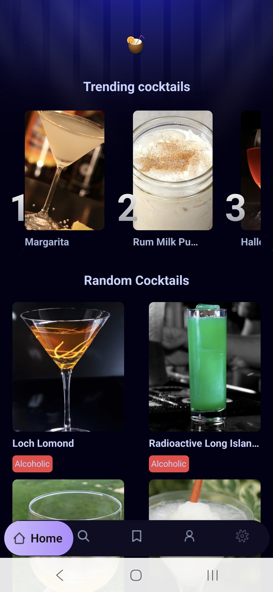
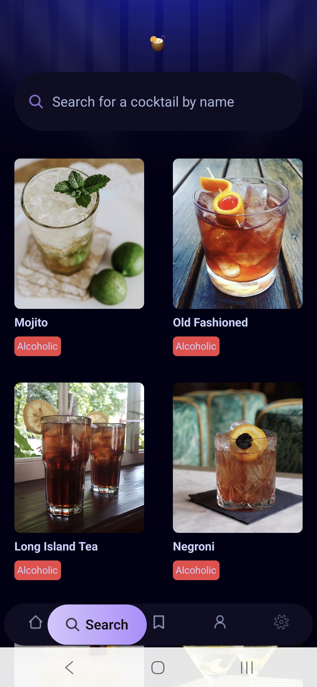
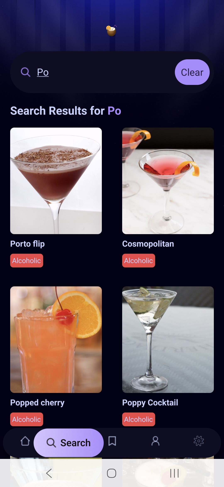
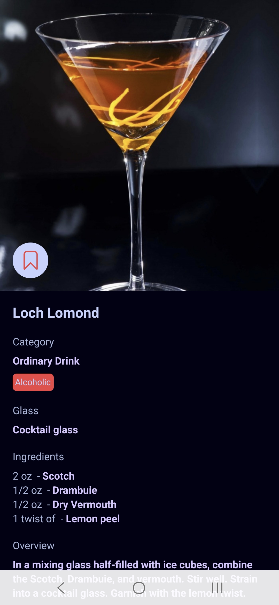
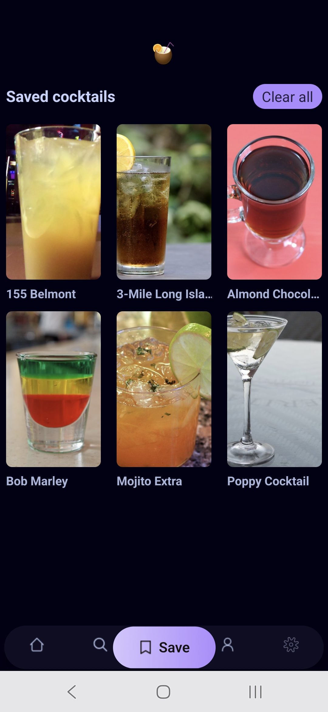
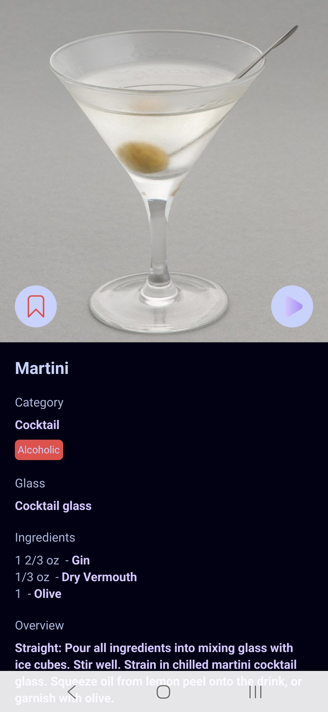

# Cocktails

Discover cocktail recipes, find drinks by name or ingredient, and keep your favorites close at hand. Cocktails brings recipe discovery and preparation details together in a simple mobile app.

## Get the app

The Google Play listing will be added after publication:

[Cocktails on Google Play](GOOGLE_PLAY_URL_HERE)

## Features

- Browse popular and trending cocktails.
- Search for cocktails by name.
- Explore drinks by alcoholic type, category, ingredient, or glass.
- View recipe ingredients, measurements, and preparation instructions. Some recipes include a preparation video.
- Save cocktails to a favorites list stored on your device.
- Open a cocktail's detailed recipe from search, browse, or your saved list.

## Screenshots

| Discover                                              | Search                                                   | Search results                                                        |
| ----------------------------------------------------- | -------------------------------------------------------- | --------------------------------------------------------------------- |
|  |  |  |

| Recipe details                                              | Saved cocktails                                  | Recipe with video                                                    |
| ----------------------------------------------------------- | ------------------------------------------------ | -------------------------------------------------------------------- |
|  |  |  |

## Run locally

### Requirements

- Node.js and npm
- Expo-compatible Android or iOS development environment, or a web browser
- API and Appwrite project configuration (see below)

### Setup

1. Install dependencies:

    ```bash
    npm install
    ```

2. Create a `.env` file in the project root and provide the values listed below.

3. Start the Expo development server:

    ```bash
    npm start
    ```

Use the Expo CLI prompts to open the app on a device or emulator. Platform-specific scripts are also available:

```bash
npm run android
npm run ios
npm run web
```

## Environment variables

The app reads its public API and Appwrite configuration from Expo environment variables. Set the following in `.env` before starting the app:

```dotenv
EXPO_PUBLIC_BASE_URL=
EXPO_PUBLIC_API_KEY=
EXPO_PUBLIC_APPWRITE_PLATFORM=
EXPO_PUBLIC_APPWRITE_PROJECT_REGION=
EXPO_PUBLIC_APPWRITE_PROJECT_ID=
EXPO_PUBLIC_APPWRITE_DATABASE_ID=
EXPO_PUBLIC_APPWRITE_TABLE_ID=
```

`EXPO_PUBLIC_BASE_URL` and `EXPO_PUBLIC_API_KEY` configure the cocktail recipe API. The Appwrite values configure the project, database, and table used to record searches and display trending cocktails. Saved cocktails are stored locally on the device.

Expo public environment variables are bundled into the client app. Do not put private keys, passwords, or other server-side secrets in these variables.

## Built with

- [Expo](https://expo.dev/) and [React Native](https://reactnative.dev/)
- [Expo Router](https://docs.expo.dev/router/introduction/) for file-based navigation
- [TypeScript](https://www.typescriptlang.org/)
- [NativeWind](https://www.nativewind.dev/) for utility-style React Native styling
- [Appwrite](https://appwrite.io/) for search statistics and trending cocktails
- [AsyncStorage](https://react-native-async-storage.github.io/async-storage/) for locally saved cocktails

# Welcome to your Expo app 👋

This is an [Expo](https://expo.dev) project created with [`create-expo-app`](https://www.npmjs.com/package/create-expo-app).

## Get started

1. Install dependencies

    ```bash
    npm install
    ```

2. Start the app

    ```bash
    npx expo start
    ```

In the output, you'll find options to open the app in a

- [development build](https://docs.expo.dev/develop/development-builds/introduction/)
- [Android emulator](https://docs.expo.dev/workflow/android-studio-emulator/)
- [iOS simulator](https://docs.expo.dev/workflow/ios-simulator/)
- [Expo Go](https://expo.dev/go), a limited sandbox for trying out app development with Expo

You can start developing by editing the files inside the **app** directory. This project uses [file-based routing](https://docs.expo.dev/router/introduction).

## Get a fresh project

When you're ready, run:

```bash
npm run reset-project
```

This command will move the starter code to the **app-example** directory and create a blank **app** directory where you can start developing.

### Other setup steps

- To set up ESLint for linting, run `npx expo lint`, or follow our guide on ["Using ESLint and Prettier"](https://docs.expo.dev/guides/using-eslint/)
- If you'd like to set up unit testing, follow our guide on ["Unit Testing with Jest"](https://docs.expo.dev/develop/unit-testing/)
- Learn more about the TypeScript setup in this template in our guide on ["Using TypeScript"](https://docs.expo.dev/guides/typescript/)

## Learn more

To learn more about developing your project with Expo, look at the following resources:

- [Expo documentation](https://docs.expo.dev/): Learn fundamentals, or go into advanced topics with our [guides](https://docs.expo.dev/guides).
- [Learn Expo tutorial](https://docs.expo.dev/tutorial/introduction/): Follow a step-by-step tutorial where you'll create a project that runs on Android, iOS, and the web.

## Join the community

Join our community of developers creating universal apps.

- [Expo on GitHub](https://github.com/expo/expo): View our open source platform and contribute.
- [Discord community](https://chat.expo.dev): Chat with Expo users and ask questions.
